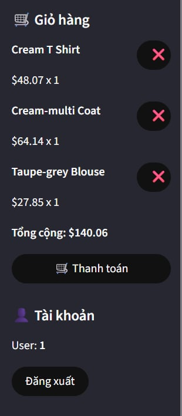

# Product Recommendation System
## 1. Introduction
### Goal:
This project develops a product recommendation system for an ecommerce platform. The system uses several recommendation techniques including collaborative filtering, content-based filtering, hybrid approach, and a multi-modal deep learning model to provide highly personalized product suggestions to users based on purchase history, browsing behavior, product metadata, images, and graph relationships. To demonstrate how these recommendation systems work, we use Streamlit to build a web store where users can log in, browse products, select a recommendation system type, add products to their cart, and make a purchase.
### Main Features
- **Collaborative Filtering**: Recommends products based on users with similar purchasing behavior.
- **Content-based Filtering**: Recommends products based on the attributes of the products the users interacted with.
- **Hybrid Approach**: Combines collaborative and content-based filtering for more robust recommendations, includes fallback with most popular products.
- **Multi-Modal Deep Learning**: Integrates user–item interactions, product images, text descriptions, and product–graph relationships into a unified multi-modal deep learning architecture for highly accurate recommendations.
- **Web Interface**: A web application built with Sreamlit for easy interaction and visualization of recommendations.
### General Workflow
The application simulates an ecommerce environment and allows users to log in with demo accounts through a Streamlit web interface. Product data, user interactions, and purchase history are generated from synthetic datasets for experimentation and demonstration purposes.
- User Interaction via Streamlit UI:
Users select a predefined demo account to simulate browsing and shopping behavior.
- Loading Simulated Data:
The system loads user information, product information, product images, interaction history, purchase history.
- Recommendation Engine Execution:
Users can choose among four recommendation modes: Collaborative Filtering, Content-Based Filtering, Hybrid Approach, Multi-Modal Deep Learning Model
- Ranking and Output Generation:
The recommendation scores are ranked and formatted into displayable product lists.
- Display on Streamlit UI:
Recommended products are shown with images, names of products, prices, rates and categories.  
**Note:** This project is a demonstration prototype. User accounts, interaction logs, and product data are simulated for experimentation and do not represent real commercial activity.
## 2. Task Allocation
- Nguyễn Đức Quang (Leader): 17.5%
  - Assign task for team members
  - Prepare dataset
  - Building Multi-Modal Deep Learning Model for recommending products
  - Building a user authentication interface (login and registration) together with the functionality for adding products to the shopping cart
  - Responsible for the login interface
- Nguyễn Thị Diễm My (Vice Leader): 16.5%
  - Find the idea for the project
  - Building 3 recommendation systems: Collaborative Filtering, Content-based Filtering, Hybrid Approach
  - Prepare the slides for presentation
- Nguyễn Trung Tùng: 16.5%
  - Prepare data set (browsing_history_expanded.csv, products_expanded.csv)
  - Prepare the slides for the presentation
- Lê Cẩm Tú: 16.5%
  - Find the idea for web design
  - Prepare data set (3 file csv remain)
- Đào Minh Dũng: 16.5%
  - Convert design to cart

### Feedback

